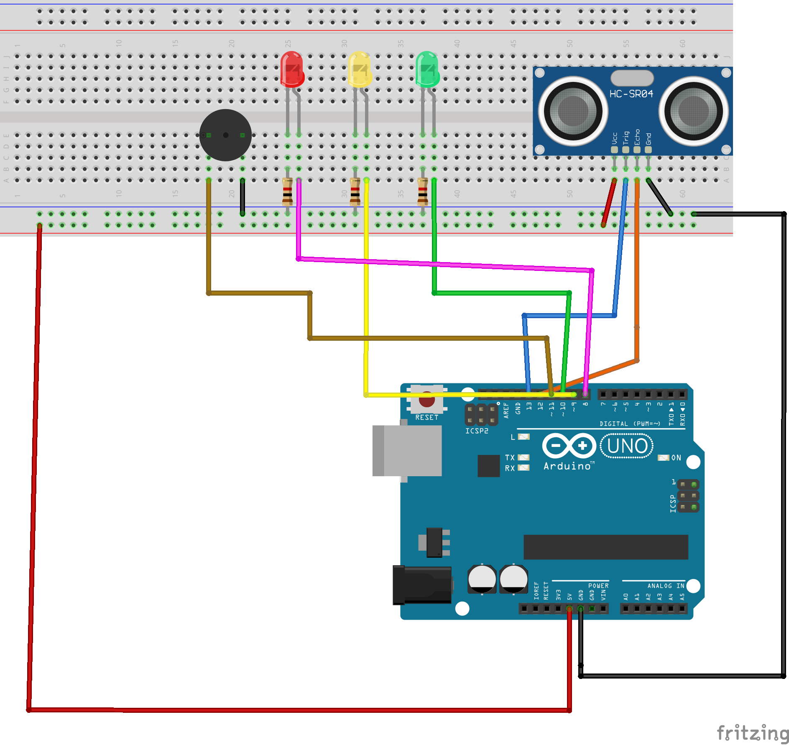

# Smart Proximity Alarm 🚨
An Arduino-based proximity detection system using ultrasonic sensors, LEDs, and buzzer alerts.

---

## 🔧 Current Features
- Measures object distance using an ultrasonic sensor (HC-SR04)
- Lights up LEDs to indicate the distance range
- Activates buzzer alarm when object is closer than 4 inches

---

## ⚙️ Hardware
| Component | Function |
|------------|-----------|
| Arduino Uno | Main controller |
| HC-SR04 | Ultrasonic distance sensor |
| Red, Yellow, Green LEDs | Distance indicators |
| Buzzer | Audio alert when threshold is reached |

---

## 🧭 Next Steps
- Add OLED display for real-time distance output
- Add button controls for threshold adjustment
- Implement SD card logging
- Optimize for low-power battery operation

---

## 🔌 Wiring Diagram

